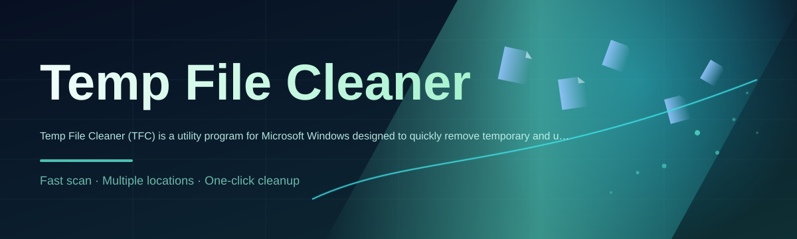

# temp-file-manager 🧹⚡

  

*One tiny tool, every scattered temp folder on your drive, gone in one pass.*

  

## 📖 About / Preview

Temp File Cleaner (TFC) started as a weekend itch: Windows scatters "temporary" files across a dozen dynamic paths, half of which change per-user, per-version, or per-update, and none of which are easy to find by hand. This repo, **temp-file-manager**, is the shipped result — a small standalone utility that hunts down those junk files and clears them out without asking you to memorize `%TEMP%` variants or dig through hidden AppData folders.

It's not a bloated "PC optimizer" suite with fake gauges and upsells. It's a focused, single-purpose cleaner: find temp files, show them, delete them, done. If you've ever run low on disk space and wondered where it all went, this is built for exactly that moment.

## 🎯 Overview

TFC exists because Windows' idea of "temporary" is anything but consistent. Between `%TEMP%`, `%TMP%`, browser caches, Windows Update leftovers, prefetch data, and application-specific scratch folders, there's no single place a normal user can check. Every version of Windows shuffles a few of these paths around, and third-party apps love inventing their own. That fragmentation is the whole reason a dedicated temp file cleaner is worth having instead of a manual "delete stuff in Temp" ritual.

This project is aimed at people who want their disk space back without babysitting a cleanup tool — solo devs testing on tight VM disks, gamers who need headroom for the next install, and everyday users who just want a "run it and forget it" utility. There's no telemetry dashboard, no subscription nag screen, no dark-pattern upsell. It's the kind of tool a solo developer builds because they needed it themselves, then ships because other people clearly need it too.

Under the hood, TFC treats "temp cleaning" as a solved problem that Windows just never solved for you: enumerate known dynamic paths, verify what's actually stale or orphaned, and clear it safely. That's it. No magic, no guesswork — just a fast, predictable pass over the mess Windows leaves behind.

  

---

## 🚀 What It Actually Does

| Capability | What's Happening |
|---|---|
| **Dynamic Path Discovery** finds temp folders wherever they're hiding | Resolves `%TEMP%`, `%TMP%`, user AppData caches, and other version-shifting locations automatically instead of relying on hardcoded strings |
| **One-Click Sweep** clears junk in a single pass | No multi-step wizards — scan and clean are one motion, built for people who just want disk space back *now* |
| **Safe-Skip Logic** avoids files currently in use | Detects locked or actively-referenced files and leaves them alone instead of throwing errors mid-run |
| **Size-Aware Reporting** shows what you're actually reclaiming | Displays a running tally of freed space so the cleanup isn't a black box |
| **Zero Footprint Install** runs standalone | No installer wizard, no background services, no registry sprawl — it runs, cleans, and gets out of your way |
| **Selective Targeting** lets you scope the cleanup | Choose specific temp categories (system, browser cache, app scratch data) instead of an all-or-nothing nuke |
| **Lightweight Core** stays fast even on big drives | Built to scan thousands of small files quickly rather than choking on directory depth |
| **Log-Friendly Output** keeps a record of what was removed | Useful for anyone who wants an audit trail before trusting an automated cleanup tool |

> [!TIP]
> Run TFC right after a big Windows Update — that's usually when leftover installer temp data piles up the most.

---

## 🏁 Up and Running

> [!NOTE]
> There's nothing to compile and nothing to configure first. This is a "download, run, done" tool by design.

1. Hit the download button above (or below) to land on the official project page.

2. Grab the latest `temp-file-manager` build for Windows from that page.

3. Launch the executable — no admin install wizard required for a standard scan.

4. Review what it found, hit clean, and watch your free space number tick upward.

> [!IMPORTANT]
> Close any browsers or heavy applications before a full sweep so more temp files are unlocked and eligible for removal.

---

## 🖥️ System Requirements

<strong>Click to expand full requirements</strong>

- **OS:** Windows 10 or Windows 11 (64-bit recommended)

- **Dependencies:** none — fully standalone executable

- **Disk space:** negligible, the tool itself is tiny; savings come from what it removes

- **Permissions:** standard user rights work for most locations; some system-level temp paths benefit from running as administrator

- **Network:** not required to run a scan or cleanup

  

---

## 🧩 How It Works

The internal flow is intentionally boring — boring means predictable, and predictable is what you want from anything that deletes files.

1. **Path Resolution** — TFC resolves every known dynamic temp location for the current Windows environment.

2. **Enumeration** — each location gets scanned for files matching temp/cache patterns.

3. **Lock Check** — files currently in use get flagged and skipped rather than force-deleted.

4. **Cleanup Pass** — everything remaining gets removed, and freed space is tallied.

5. **Report** — a summary shows what was cleaned so you're never guessing what happened.

---

## 🛟 Troubleshooting

**Q: TFC says a file is "in use" and skips it — is that normal?**
Yes. That's the lock-check doing its job. Forcing deletion on an open file is how you get corrupted app state, so TFC skips it instead.

**Q: I ran a scan and barely reclaimed any space — why?**
Some systems get cleaned regularly by other maintenance tools already, or the bulk of the space is sitting in browser cache categories you didn't select. Try running a full scope scan.

**Q: Does this touch my Recycle Bin?**
No. TFC targets temporary/cache files specifically, not deliberately-deleted user files sitting in the Recycle Bin.

**Q: Will cleaning temp files break any installed applications?**
Generally no — legitimate temp data is regenerated as needed by the OS or app. TFC's lock-check also avoids anything actively required at runtime.

**Q: Do I need administrator rights?**
Not for most user-level temp paths. Some system-wide locations may require elevated permissions to fully clear.

> [!WARNING]
> Always close unrelated running applications before a deep clean — an app mid-write to its temp folder is exactly the kind of thing the lock-check exists to protect.

---

## 🎨 UI / UX Details

| Element | Detail |
|---|---|
| **Themes** | Light and dark modes, auto-detected from Windows theme setting |
| **Keyboard shortcuts** | `Ctrl+R` rescan, `Ctrl+Enter` run cleanup, `Esc` cancel active scan |
| **Settings** | Persisted between sessions — scope selections, theme, and last scan summary |
| **Progress feedback** | Live counter of files scanned and space reclaimed during the pass |

> [!NOTE]
> Settings are stored locally next to the executable — nothing is synced or uploaded anywhere.

---

## 🤝 Contributing & Community

This started as a solo project, and contributions are what keep it sharp. Bug reports, path-discovery suggestions for newer Windows builds, and UI polish are all welcome.

> Found a temp path TFC doesn't catch yet? Open an issue with the path and Windows version — that's the single most useful kind of report.

- Fork the repo and branch off `main`

- Keep changes focused — one fix or feature per pull request

- Describe *why* a change matters, not just *what* changed

---

## 📜 License

Released under the [MIT License](LICENSE), 2026. Use it, modify it, ship it in your own toolkit — just keep the license notice intact.

---

## ⚖️ Disclaimer

Temp File Cleaner is provided as-is, with no warranty of any kind. Deleting files always carries some inherent risk, even when scoped to temp/cache locations. Review what's being cleaned before confirming, keep backups of anything irreplaceable, and use the tool at your own discretion. The maintainer is not responsible for data loss resulting from misuse or edge cases specific to your system configuration.

  

